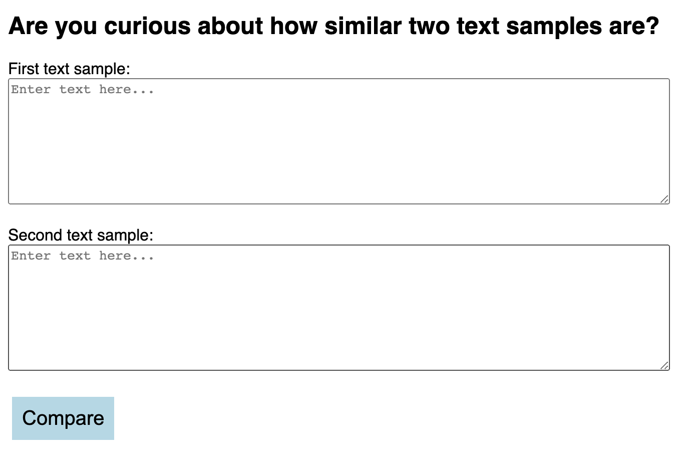
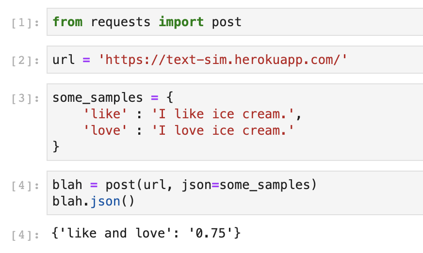

# Measuring the similarity between two texts

I used [this notebook](testing/test-text-sim.ipynb) to develop an MVP model. I went with cosine similarity of word counts.

---
## Run as a Python Script
The python script can be run on the command line. It takes in a json file with the text samples.

```
$ python text_similarity.py <file.json>
```
If you are in the root of this repository, you can run the following line.
```
$ python app/text_similarity.py samples.json
```
The output would be:
```
Sample1 and Sample2 have a similarity of 0.89
Sample1 and Sample3 have a similarity of 0.56
Sample2 and Sample3 have a similarity of 0.58
```
---
## Deployed on Heroku with a simple user interface  
I deployed the app using Flask, Heroku, and Docker.  
[text-sim.herokuapp.com](text-sim.herokuapp.com)  
It has a simple interface, and can also take post requests.
 



## Access the app using a post request




---
## The Docker container is on Dockerhub
```
$ docker pull neefasa/text-similarity
```